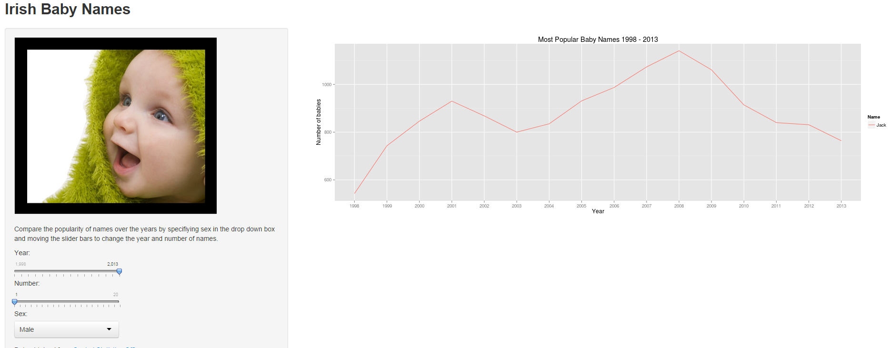

Most Popular Baby Names for Ireland
========================================================
author: Chris Daly
date: 21/09/2014

Why Baby Names???
========================================================
Many expecting parents spend days deliberating on what's a "good" name for their baby. The criteria for this differs from person to person but most people like traditional names that are not too common. By using this applet, parents can see the most popular names for any given year and see how it trends with time.

Another potential use is for people to link noticeable peaks and valleys in a name's popularity with pop culture events.

Data
========================================================
The data was downloaded and pre-processed into a useful format using R and a px package.


```r
head(boys_data)
```

```
   Year Name Rank Amount
1  1998 Jack    3    543
3  1999 Jack    3    743
5  2000 Jack    1    846
7  2001 Jack    1    930
9  2002 Jack    1    868
11 2003 Jack    2    800
```

Using the App
========================================================

Specifiy the following using slider bars & dropdown box:
- Year
- Number of names
- Sex

About
========================================================

This applet was made as a project for Coursera's class on Developing Data Products. 

It uses data available from the Central Statistics Office in order to generate graphs on the most popular baby names in Ireland for specific years.

It was written in R and hosted by shiny apps at https://strout.shinyapps.io/Names
